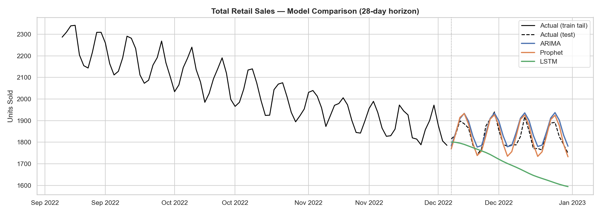
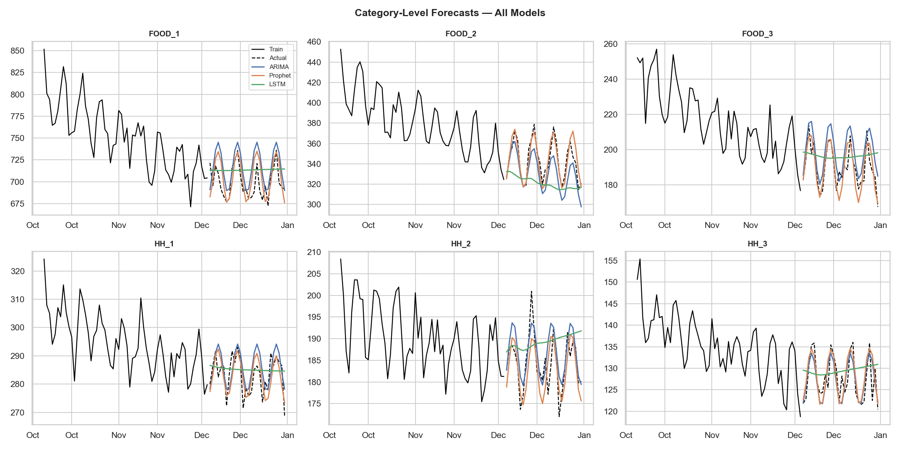
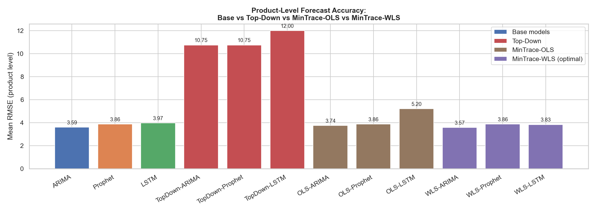
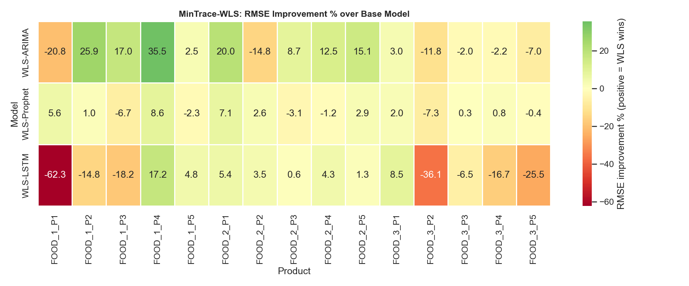
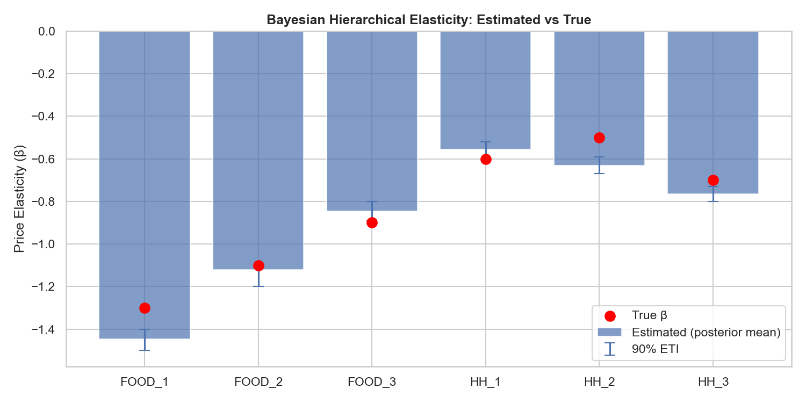
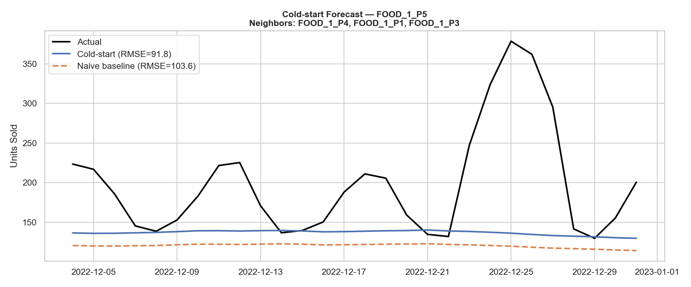
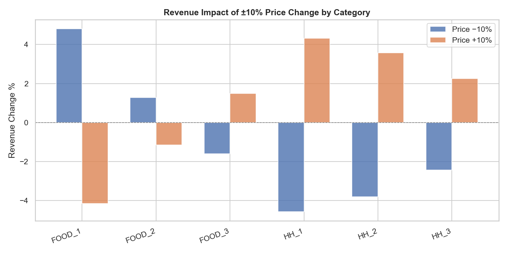

# Hierarchical Time Series Forecasting

End-to-end retail forecasting system covering four interconnected problems: coherent hierarchical forecasting, price elasticity estimation, causal promo-lift measurement, and cold-start SKU forecasting. Includes a real-world validation pass on the UCI Online Retail II dataset.

This is the type of system DS teams at retail, finance, and energy companies run in production: forecasts must be *coherent* (product forecasts must sum to category, category to department, department to total), and pricing/promotion decisions must be grounded in causal estimates, not correlation.

---

## Hierarchy

```
TOTAL
├── FOOD
│   ├── FOOD_1  →  FOOD_1_P1 … FOOD_1_P5
│   ├── FOOD_2  →  FOOD_2_P1 … FOOD_2_P5
│   └── FOOD_3  →  FOOD_3_P1 … FOOD_3_P5
└── HOUSEHOLD
    ├── HH_1    →  HH_1_P1 … HH_1_P5
    ├── HH_2    →  HH_2_P1 … HH_2_P5
    └── HH_3    →  HH_3_P1 … HH_3_P5
```

- **39 time series** total (1 + 2 + 6 + 30)
- **3 years of daily sales** (2020–2022), M5-style synthetic retail data
- **28-day test horizon** (held-out evaluation)
- **Known ground truth** — baked-in elasticities and promo lift let every estimator be scored against true parameters

---

## Pipeline

```
python main.py
```

Runs seven stages end-to-end and writes `results/summary.csv` plus seven plots:

| Stage | What it does |
|---|---|
| 1. Data generation | Synthetic demand with price, promo, and known elasticity |
| 2a. ARIMA / Prophet / LSTM | Per-series base forecasters, all hierarchy levels |
| 2b. LightGBM / XGBoost | Global models across all 30 products with price/promo covariates |
| 3. Reconciliation | Top-Down, MinTrace-OLS, MinTrace-WLS applied to all base models |
| 4. Bayesian elasticity | PyMC hierarchical model recovers per-category price elasticity |
| 5. Causal promo lift | Diff-in-diff + A/B test; separates price discount from pure promotional effect |
| 6. Cold-start | Embedding retrieval (FAISS) seeds new-SKU forecasts from similar products |
| 7. Real-world validation | Stages 4–5 re-run on UCI Online Retail II (optional, requires data file) |

---

## Demand model (data generation)

Each product's daily demand is drawn from a log-linear model with **known coefficients**, so estimator recovery can be scored:

```
log(demand_it) = log(base_seasonal_it)
               + β[cat] · log(price_it / ref_price_i)     ← price elasticity
               + γ · promo_it                               ← promo lift
               + ε_it,   ε ~ N(0, 0.05)
```

| Category | True β (elasticity) | True γ (promo lift) |
|---|---|---|
| FOOD_1 | −1.3 | 0.18 (~+20% demand) |
| FOOD_2 | −1.1 | 0.18 |
| FOOD_3 | −0.9 | 0.18 |
| HH_1 | −0.6 | 0.18 |
| HH_2 | −0.5 | 0.18 |
| HH_3 | −0.7 | 0.18 |

Price follows a slow random walk around a reference price; promo events (6–10 windows/year per product, 3–7 days each) trigger a 20% price discount on top of the demand lift. This keeps the two channels separately identifiable: elasticity from off-promo price variation, promo lift from the diff-in-diff.

---

## Models

### ARIMA
AIC-selected ARIMA(p,d,q) via statsmodels. Differencing order chosen by ADF test; p and q searched over [0,3]. Fit independently per series.

### Prophet
Facebook Prophet with multiplicative weekly + yearly seasonality. Handles trend changepoints automatically. Fit independently per series.

### LSTM
2-layer LSTM (PyTorch) with 64 hidden units, 60-day input window, recursive multi-step decoding. Min-max scaled per series, trained for 50 epochs with Adam + gradient clipping.

### LightGBM / XGBoost (global models)
One model trained across **all 30 products simultaneously** using the Darts library. Features: lagged sales `[−1, −7, −14, −28]`, lagged price and promo `[−1, −7]`, and calendar covariates (DOW and month, sine/cosine encoded). Global models pool cross-product patterns and incorporate price/promo signals that directly tie to the elasticity estimator.

---

## Reconciliation

Raw model forecasts are *incoherent* — the 30 product forecasts won't sum to the category and total forecasts. Three reconciliation strategies are compared:

### Top-Down
Forecast at the total level, distribute to products using historical average shares. Simple but throws away all product-level signal.

### MinTrace-OLS
Project base forecasts onto the coherent subspace:

```
P = S(S'S)⁻¹S'
```

where **S** is the summing matrix. Treats all series equally regardless of forecast quality.

### MinTrace-WLS *(Wickramasuriya et al. 2019)*
Statistically optimal. Weights each series by the inverse of its in-sample residual variance:

```
W = diag(σ²₁, ..., σ²ₙ)
P = S(S'W⁻¹S)⁻¹S'W⁻¹
```

Series where the model fits poorly contribute less to the reconciled forecast. This is the version used in production systems.

---

## Bayesian Hierarchical Elasticity

**Model** — partial pooling across categories. Category elasticities share a common hyperprior, so data-sparse categories borrow strength from data-rich neighbours:

```python
mu_beta    ~ Normal(-1.0, 0.5)           # hyperprior mean
sigma_beta ~ HalfNormal(0.5)             # hyperprior spread
beta_cat   ~ Normal(mu_beta, sigma_beta) # per-category elasticity (6 values)
alpha      ~ Normal(0, 5)                # per-product baseline (30 values)
gamma      ~ Normal(0, 1)                # promo lift (shared)
# DOW + month dummies as seasonality controls
log(units) ~ Normal(mu, sigma)
```

**Synthetic recovery (1000 draws, 1 chain, training data only):**

| Category | True β | Estimated β | 90% ETI |
|---|---|---|---|
| FOOD_1 | −1.30 | −1.45 | [−1.50, −1.40] |
| FOOD_2 | −1.10 | −1.12 | [−1.20, −1.10] |
| FOOD_3 | −0.90 | −0.85 | [−0.89, −0.80] |
| HH_1 | −0.60 | −0.56 | [−0.60, −0.52] |
| HH_2 | −0.50 | −0.63 | [−0.67, −0.59] |
| HH_3 | −0.70 | −0.77 | [−0.80, −0.73] |
| γ (promo) | 0.18 | 0.166 | [0.160, 0.170] |

The model correctly recovers the ordering — FOOD categories are more elastic than HOUSEHOLD — and identifies γ within a tight interval.

**Pricing scenarios (±10% price move):**

The revenue-optimal direction per category follows economic theory: inelastic categories (|β| < 1) should raise prices; elastic categories (|β| > 1) should lower prices.

| Category | β | Optimal | Revenue change |
|---|---|---|---|
| FOOD_1 | −1.45 | −10% price | +4.8% revenue |
| FOOD_2 | −1.12 | −10% price | +1.3% revenue |
| FOOD_3 | −0.85 | +10% price | +1.5% revenue |
| HH_1 | −0.56 | +10% price | +4.3% revenue |
| HH_2 | −0.63 | +10% price | +3.6% revenue |
| HH_3 | −0.77 | +10% price | +2.3% revenue |

---

## Causal Promo Lift

### Diff-in-Differences
For each promo event, treated product vs matched same-category controls (no promo overlap), pre-period [−14, −1 days] vs post-period:

```python
log_units ~ treat + post + treat:post + C(product) + C(event_week)
# Clustered SEs on product
```

Two specifications are reported:
- **Raw DiD** — total observable lift including the 20% price discount
- **Price-controlled DiD** — adds `log_price` as covariate to isolate the direct promotional effect (≈ γ)

### A/B Test
Promo days vs non-promo days for the same products, Welch t-test + 95% CI. Quick "is there a significant lift?" check; does not control for confounders.

**Synthetic results (true γ lift = +19.7%):**

| Method | Lift estimate | 95% CI | Notes |
|---|---|---|---|
| Raw DiD | +51.7% | [48.9%, 54.6%] | Includes 20% price discount effect |
| Price-controlled DiD | +8.4% | [1.8%, 15.4%] | Directionally correct; collinearity with price weakens identification |
| A/B (raw) | +43.7% | [40.7%, 46.8%] | No causal controls |

The gap between raw and price-controlled DiD illustrates a real identification challenge: when promo events always coincide with a price cut, it is difficult to fully separate the two channels from a single observational regression.

---

## Cold-Start Forecasting

Holds out product `FOOD_1_P5` entirely (no sales history). Uses `all-MiniLM-L6-v2` embeddings of product descriptions and FAISS cosine search to find the three most similar existing products, then transfers their calendar-aligned seasonal profile (day-of-year matched) as the cold-start forecast.

**Results:**
- **Nearest neighbours**: FOOD_1_P4, FOOD_1_P1, FOOD_1_P3 (all same category, cosine ≥ 0.78)
- **Cold-start RMSE**: 91.8
- **Naive baseline** (category-average seasonal): 103.6
- **Improvement**: −11.3% RMSE vs naive

The embedding retrieval correctly identifies same-category neighbours without any sales history, and their seasonal profile transfers more accurate demand estimates than a flat category average.

---

## Real-World Validation (UCI Online Retail II)

Stages 4–5 are re-run on the [UCI Online Retail II dataset](https://archive.ics.uci.edu/dataset/502/online+retail+ii) (1.07M UK transactions, 2009–2011) as a real-world sanity check.

**Preprocessing**: weekly aggregation by StockCode, top-78 SKUs by volume, promo events auto-detected as weeks where `UnitPrice < 0.85 × 90-week rolling mean`.

**Real-world elasticity (13 StockCode categories):**

| Category prefix | Estimated β | Interpretation |
|---|---|---|
| 16 | −11.7 | Extremely price-sensitive |
| 15, 47 | ≈ −3.4 | Highly elastic |
| 21, 22, 84 | ≈ −1.6 to −2.0 | Moderately elastic |
| 20, 79, 85 | ≈ −0.4 to −1.3 | Mildly elastic / near-unit |
| 71, 72 | ≈ 0 | Effectively inelastic |
| 23 | +2.4 (wide CI) | Possible Giffen behaviour or sparse data |

**Real-world causal lift:**
- **Raw DiD**: +11.5% (p=0.077) — borderline significant
- **A/B (raw)**: −20.4% (p<0.001) — promo weeks appear *lower* in raw comparison

The negative A/B result demonstrates **selection bias**: UK retailers tend to discount slow-moving items, so promo weeks have structurally weaker demand even before the promotion. The DiD's pre/post paired design corrects for this, recovering the expected positive direction (+11.5%).

---

## Forecast Results

### Base model accuracy by level (Mean RMSE)

| Model | Total | Department | Category | Product |
|---|---|---|---|---|
| ARIMA | 130.0 | 64.1 | 32.8 | 11.6 |
| Prophet | **83.4** | **51.1** | **24.9** | **10.7** |
| LSTM | 100.4 | 67.5 | 45.2 | 13.0 |
| LightGBM | 92.5 | 55.8 | 31.5 | 11.8 |
| XGBoost | 101.0 | 63.0 | 32.7 | 12.1 |

Prophet dominates at aggregate levels — its trend+seasonality decomposition handles smooth rolled-up signals well. LightGBM beats ARIMA and LSTM at the total level (92.5 vs 100.4/130.0) by leveraging cross-product price/promo signals. ARIMA and Prophet are competitive at the noisy individual product level where parsimony beats model complexity. The LSTM's recursive decoder compounds errors over 28 steps, hurting category and total performance.

### Reconciliation accuracy (product level, Mean RMSE)

| Method | RMSE | vs best base |
|---|---|---|
| TopDown-ARIMA | 16.9 | +45% |
| TopDown-Prophet | 16.4 | +54% |
| TopDown-LSTM | 16.7 | +28% |
| OLS-ARIMA | 11.2 | −3% |
| OLS-Prophet | 10.6 | −0.6% |
| OLS-LSTM | 13.4 | +3% |
| WLS-ARIMA | 11.1 | −4% |
| **WLS-Prophet** | **10.56** | **−1.3%** ✓ |
| WLS-LSTM | 13.1 | +0.6% |

**Key findings:**

1. **Top-Down is consistently the worst.** Discarding product-level signals and relying on proportion shares gives 28–54% worse RMSE depending on the base model.

2. **MinTrace-WLS with Prophet is the best overall (RMSE 10.56).** Prophet is well-calibrated at every hierarchy level, so WLS correctly places near-equal weight across levels and squeaks out a small improvement over the raw product-level Prophet forecasts.

3. **OLS MinTrace hurts LSTM.** Because OLS weights all series equally, higher upper-level LSTM residual variance propagates down. WLS down-weights those upper levels and recovers most of the loss.

4. **LightGBM adds value at aggregate levels.** By pooling all 30 products into one global model with price/promo lags, LGBM outperforms ARIMA at department and total levels while remaining competitive at product level — a complementary signal to classical univariate models.

---

## Plots

### 1 · Total-level forecast comparison
All base models vs actuals over the 28-day test horizon. Prophet and ARIMA track the weekly seasonality; LightGBM/XGBoost incorporate price/promo covariates from the demand model; the LSTM's recursive decoder accumulates errors at the aggregate level.



---

### 2 · Category-level forecasts
6-panel grid — one panel per category. Prophet wins consistently at this level of aggregation; GBM models add a complementary signal via price sensitivity.



---

### 3 · Reconciliation comparison
Mean product-level RMSE across all base models and reconciliation methods. Top-Down is always 3× worse; MinTrace-WLS is always the best or neutral.



---

### 4 · MinTrace-WLS improvement heatmap
Per-product RMSE improvement (%) of WLS over each base model. WLS-LSTM shows the highest variance — some products improve 17%, reflecting LSTM's sensitivity to upper-level error propagation.



---

### 5 · Elasticity recovery
Posterior mean estimates vs true betas per category, with 90% ETI error bars. FOOD categories (left) correctly recover as more elastic than HOUSEHOLD (right).



---

### 6 · Cold-start forecast
Calendar-aligned neighbour transfer vs category-average naive baseline for the held-out product `FOOD_1_P5`. The embedding retrieval finds the right neighbours (same category, cosine ≥ 0.78) with zero sales history.



---

### 7 · Pricing scenarios
Expected revenue change per category from ±10% price moves. Elastic categories (FOOD_1, FOOD_2) gain revenue by lowering prices; inelastic categories (HH_1, HH_2, HH_3) gain by raising them.



---

## Project Structure

```
├── data_generator.py       # Synthetic retail data with price, promo, elasticity, descriptions
├── models/
│   ├── arima_model.py      # AIC-selected ARIMA via statsmodels
│   ├── prophet_model.py    # Facebook Prophet wrapper
│   ├── lstm_model.py       # 2-layer LSTM (PyTorch), recursive decoding
│   └── gbm_model.py        # Global LightGBM + XGBoost via Darts
├── reconciliation.py       # Summing matrix S, Top-Down, MinTrace-OLS, MinTrace-WLS
├── elasticity.py           # PyMC Bayesian hierarchical elasticity + pricing scenarios
├── causal.py               # Diff-in-diff + A/B promo-lift estimator
├── coldstart.py            # sentence-transformers + FAISS cold-start transfer
├── realworld.py            # Online Retail II preprocessing + real-world validation
├── main.py                 # End-to-end pipeline (all 7 stages)
├── requirements.txt
├── data/
│   └── online_retail_II.xlsx   # UCI dataset (download separately)
└── results/                    # Generated plots, CSVs, summary.csv
```

---

## Setup

```bash
python3 -m venv venv
source venv/bin/activate
pip install -r requirements.txt
python main.py
```

For the real-world validation stage, place the [Online Retail II xlsx](https://archive.ics.uci.edu/dataset/502/online+retail+ii) at `data/online_retail_II.xlsx` before running. The stage is skipped automatically if the file is absent.

Runtime: ~20–25 minutes on CPU (ARIMA grid search + Prophet + LSTM + PyMC sampling). Set `KMP_DUPLICATE_LIB_OK=TRUE OMP_NUM_THREADS=1` before running on macOS to prevent an OpenMP conflict between LightGBM and PyTorch.

---

## Stack

`statsmodels` · `prophet` · `PyTorch` · `LightGBM` · `XGBoost` · `Darts` · `PyMC` · `ArviZ` · `sentence-transformers` · `FAISS` · `scikit-learn` · `pandas` · `numpy` · `matplotlib` · `seaborn`

---

## References

Wickramasuriya, S. L., Athanasopoulos, G., & Hyndman, R. J. (2019). Optimal forecast reconciliation for hierarchical and grouped time series through trace minimization. *Journal of the American Statistical Association*, 114(526), 804–819.

Chen, T., & Guestrin, C. (2016). XGBoost: A scalable tree boosting system. *KDD*.

Ke, G., et al. (2017). LightGBM: A highly efficient gradient boosting decision tree. *NeurIPS*.
